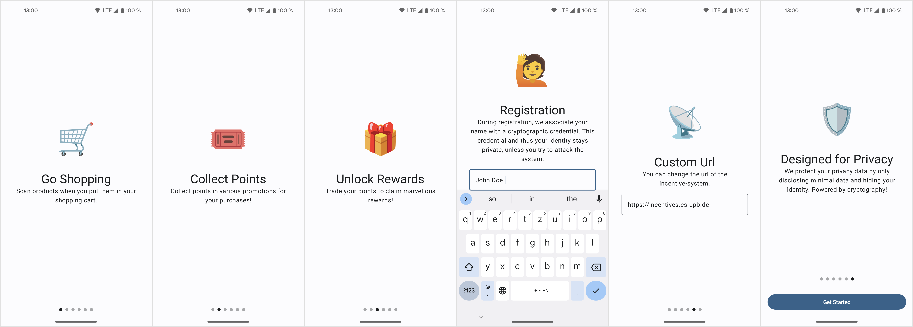
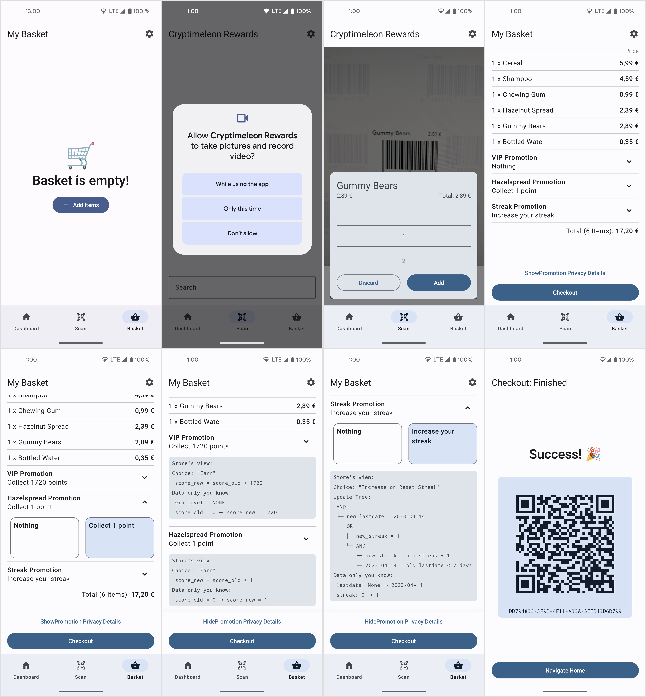
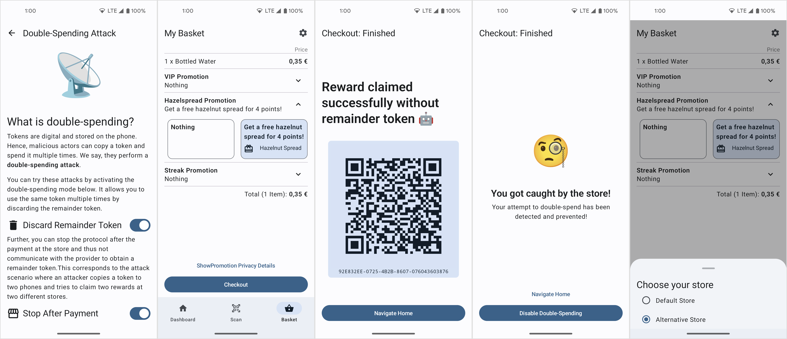
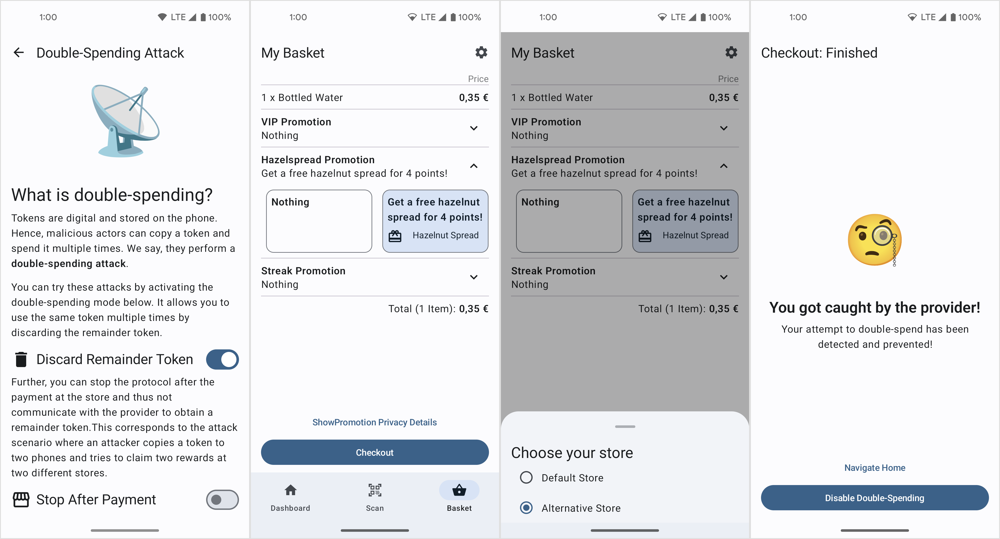
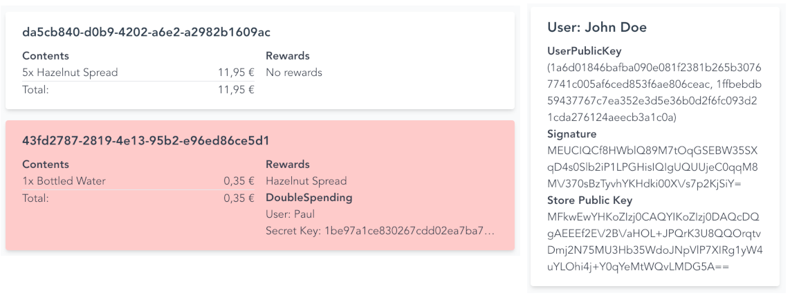

# Cryptimeleon Incentive System 

This project is an implementation of
the [Privacy-Preserving Incentive Systems with Highly Efficient Point-Collection](https://eprint.iacr.org/2020/382)
paper published in 2020 with improvements for real-world scenarios.
Our incentive system for retail stores rewards users for their shopping behavior, e.g. for buying certain products or shopping regularly.
In contrast to currently deployed incentive systems, it protects users' privacy using cryptography.
You can watch this [presentation on youtube](https://www.youtube.com/watch?v=Up-ECbJ4w5U&t=1s)
to learn more about the basic ideas of this project.

We developed this project at Paderborn University within the transfer project _T2_ of the _CRC 901 – On-The-Fly Computing_.

## Walkthrough

We provide a walkthrough of a user's view of the system during a shopping:

### Onboarding

On the first startup, the user goes through the onboarding process, needs to register once with their name, and can potentially change the deployment's URL.
Then, the app generates keys and registers the user with their identity.
Note that this identity cannot be linked with transactions and is only used to trace users who attempt a double-spending attack.

<picture>
  <source media="(prefers-color-scheme: dark)" srcset="./.github/images/onboarding-dark.png">
  
</picture>

### Shopping

The user has joined the system.
In the background, the app queried all running promotions (campaigns) and joined each promotion which means that the user has an empty token for each promotion on their phone.
Now, the user can go shopping:
For this, they go to the scanner view, give the app access to the camera, and scan products while going through the store.
This process resembles new retail technology where users can scan products along the go.
For demo purposes, we provide the barcodes on the incentive system's web frontend.
After scanning, the user can select updates to their promotions that apply, e.g. collect 1 point for the hazelnut spread in the basket.
Further, they can view the privacy implications of the selected updates in the privacy details view.
After activating checkout, the app runs the crypto protocols, 'pays' the basket, and finally shows a QR code of the corresponding basket.
This serves as proof/receipt when leaving the store and for claiming physical rewards.

<picture>
  <source media="(prefers-color-scheme: dark)" srcset="./.github/images/shopping-dark.png">
  
</picture>

### Promotions

A core concept of the business logic of our incentive system is the concept of promotions.
For each token that a user has, there is a respective promotion with well-defined rules.
Our prototype currently supports three types of promotions:
1. _VIP promotion_: Users earn points for spending money. After reaching a certain amount, they reach a VIP level (Bronze, Silver, Gold) that enables permanent effects like discounts.
2. Point count promotions: Point count promotions are the simplest promotions. Users can collect points, e.g. for buying certain items, and spend points to get rewards. Our _Hazelspread promotion_ is such a promotion: For every four jars of hazelnut spread users get one for free.
3. _Streak promotion_: Users can build up a streak by shopping within seven days of the last visit. Having a certain streak enables rewards.

In the app, users can see their current state in all running promotions and which rewards they are eligible to get.
Further, we display a token id, a hash of the current token, which is similar to a GitHub commit hash.

<picture>
  <source media="(prefers-color-scheme: dark)" srcset="./.github/images/promotions-dark.png">
  
</picture>

### Double-spending Attacks

The canonical attack to our incentive system is a double-spending attack: An attack, where an attacker copies a digital token and spends it twice to either obtain two valid remainder tokens and therefore double their money, or to claim some reward twice and therefore get more than the token is worth.
We implement attack capabilities in our app to showcase how our system handles these attacks.
Note that in a real-world deployment, some of these attacks would only be possible with timing attacks (i.e. within a small period until services synchronize data), or in case a store goes offline.

For the first attack scenario, the attacker enables the _discard remainder token_ and _store after payment_ options in the apps attack ui.
This tells the app to use the current token until deactivated, instead of replacing it with a new token after a transaction.
In the example, the attacker has enough points to get a reward and claims it at the store.
If they try to spend the same token again at the same store, they get caught and their identity leaks, we show this later.
However, they can go to another store (in our case change the current store in the settings), and spend the token again to get a second reward.
After some time, the stores synchronize their transaction data and find this double-spending attack.
The link algorithm extracts the attacker's identity such that stores can reclaim the stolen rewards with legal measures.

<picture>
  <source media="(prefers-color-scheme: dark)" srcset="./.github/images/double-spending-store-dark.png">
  
</picture>

In the second attack scenario, the attacker wants to take a token _T1_ worth 16 and spend 4 points twice to get two valid tokens _T2_ each worth 12 points.
These would be worth 24 in total and thus the attacker would have stolen 8 points.
To try this, the attacker enables the _discard remainder token_ option in the double-spending options.
Then, they do the first spend transaction at the first store, which is successful.
Then, they switch the store and try to get another remainder token.
This attempt is blocked directly by the provider service, which is the only service that can update tokens and prevents this attack with a blacklist.
Further, the attacker again leaked their identity and can be penalized for this double-spending attempt.

<picture>
  <source media="(prefers-color-scheme: dark)" srcset="./.github/images/double-spending-provider-dark.png">
  
</picture>

We previously mentioned that attackers' identities leak during double-spending attacks.
For this, we have a web frontend with an overview of all registered users and their public keys.
During double-spending, the corresponding secret key leaks and stores can identify attackers.
Every store has a UI that displays all baskets and marks baskets that are associated with a double-spending attack in red.
For this prototype, we only use a name to identify users, however, in the real world, this could be enriched with more information.

## Developing

This project consists of an android app developed with Kotlin and Jetpack Compose, multiple Spring Boot services and packages for the cryptographic protocols and business logic (promotions).
The cryptographic protocols are powered by [cryptimeleon](https://cryptimeleon.org).

### Building

To build the project, you need Java 11 and Android SDK 33 (can be installed with
[sdkmanager](https://developer.android.com/studio/command-line/sdkmanager) or via Android Studio).

### Benchmark

To run a benchmark, install mcl following these [instructions](https://github.com/cryptimeleon/mclwrap) and
run `./gradlew :crypto:benchmark`.

### Swagger API

When you start the services (either locally or via docker), you can access the swagger api page
at `basepath/swagger-ui/index.html`.

### Creating promotions and choosing images

You can configure own promotion-sets in the bootstrap service.
To add images, put the image in the `web/public/assets/` folder.
Use the promotion_name in lower case with spaces replaced by underscores and choose the jpg format.
For a promotion named `Christmas Promotion`, name the image `christmas_promotion.jpg`.

### Deployment

#### Services

We provide docker images of the services for custom deployments.
To deploy the incentive-system follow these steps (tested on linux and macOS):
 0. Install docker (tested on version 20.10.12) and docker-compose (tested on version 1.29.2)
 1. Checkout this repository (you only need the contents of the deployment folder)
 2. Change the HOST variable in `deployment/deploy.sh` to your server's url or `localhost:8009` for a local installation
 3. Run `./deployment/deploy.sh`
 4. The deployment runs at port `8009`

If you want to build docker images locally, you can use the command `./deployment/build-docker-images.sh`.

#### App

You can change the deployment's url in `app/build.gradle` by setting the `deploymentBaseUrl` variable before building.
For local deployments, use the naming scheme `http://xxx.xxx.xxx.xxx:8009` and add the line `android:usesCleartextTraffic="true"` to the `AndroidManifest.xml` to enable http.

## License

Apache License 2.0, see [LICENSE](LICENSE) file.
